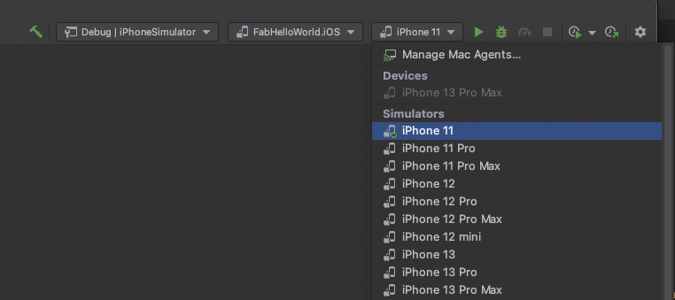
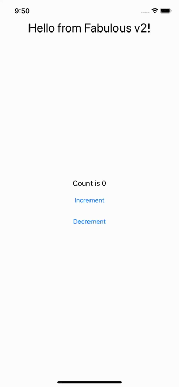

## Requirements

You will need to install a few different tools to work with Fabulous:

- .NET 6.0 SDK or newer ([link](https://dotnet.microsoft.com/))
- A compatible IDE:
  - Visual Studio 2021 or newer ([link](https://visualstudio.microsoft.com/vs/))
  - Visual Studio 2019 for Mac or newer ([link](https://visualstudio.microsoft.com/vs/mac/))
  - JetBrains Rider ([link](https://www.jetbrains.com/rider/) - available for Windows and macOS)
- During installation, you will be asked to choose the workloads you want. Be sure to select the mobile development workload and F#.

_Note: if you choose JetBrains Rider, you will also need to install either Visual Studio or Visual Studio Mac since Rider won't install those workloads by itself._

## Creating a new Fabulous project

### 1. Download the latest templates

First, we need to install the latest templates for Fabulous. This is done via command line.
Open a terminal in the folder where you want to store the new solution, and type the following command:

```sh
dotnet new install Fabulous.XamarinForms.Templates
```

This will add Fabulous.XamarinForms to the templates available for `dotnet new`.

```sh
dotnet new --list
```


### 2. Create the project

Now, we can create the solution using the newly installed template:

```sh
dotnet new fabulous-xf -n FabHelloWorld
```

_Note: if you plan to use Visual Studio on Windows, use `fabulous-xf-vswin` instead. Visual Studio doesn't support the default template._

### 3. Build and run

In your IDE, you will be able to choose the configuration profile, the project to start and the device or simulator to use.

#### Debugging on Android device or emulator

For debugging Android, select Android project and the profile `Debug | Any CPU`, then select any device or emulator you want.


#### Debugging on a iPhone device

For debugging iOS on a real iPhone device, select the iOS project and the profile `Debug | iPhone`, then select any connected device you want.


#### Debugging on an iPhone simulator

For debugging iOS on a simulator, select the iOS project and the profile `Debug | iPhoneSimulator`, then select any simulator you want.



You can start debugging like usual and the app will launch.



## Understanding the project structure

Fabulous implements the MVU design pattern. MVU stands for Model-View-Update.


_Credits: Beginnnig Elm - https://elmprogramming.com_

MVU is a simple state machine for making reliable UI applications.

We have a `Model` storing the state of the application.
This state is immutable, it can only be mutated during the evaluation of the `update` function.
This is done to help prevent side effects from making your app unstable.

To trigger an update, we have `Msg` (messages) that are dispatched from the user interface or from internal subscriptions (like a timer).
Upon dispatch, Fabulous will call the `update` function to know how the state will change.

Everytime the state changes, Fabulous will also call the `view` function.
This function returns a virtual view (much like Virtual Dom if you're used to React) that Fabulous will compare with the current UI to determine which changes to make. Thus we can understand the UI as a function of the state, like shown in this image:


_Credits: Flutter docs - [Start thinking declaratively](https://docs.flutter.dev/development/data-and-backend/state-mgmt/declarative)_

In the blank template, you will find everything inside the `App.fs` file of the `FabHelloWorld` shared project.

The `Model` type defines the application state. You can store any value you need for the lifetime of the application inside it.

```fs
type Model =
    { Count: int }
```

The `Msg` discriminated union lets you define all events that will change the application state.

```fs
type Msg =
    | Increment
    | Decrement
```

`init` is a function called at the start of the application to get the default application state.

```fs
let init () =
    { Count = 0 }
```

`update` is a function called whenever a `Msg` is received. Inside you can update the current `Model` to change the application state.

```fs
let update msg model =
    match msg with
    | Increment -> { model with Count = model.Count + 1 }
    | Decrement -> { model with Count = model.Count - 1 }
```

`view` is a function returning a view description for the current `Model`.
You can notice that controls that can be interacted with can dispatch a `Msg`, e.g. `Button("Increment", Increment)`.

```fs
let view model =
    Application(
        ContentPage(
            "FabHelloWorld",
            VStack() {
                Label("Hello from Fabulous v2!")
                    .font(namedSize = NamedSize.Title)
                    .centerTextHorizontal()

                (VStack() {
                    Label($"Count is {model.Count}")
                        .centerTextHorizontal()

                    Button("Increment", Increment)
                    Button("Decrement", Decrement)
                })
                    .centerVertical(expand = true)
            }
        )
    )
```

`Program.statefulApplication` bootstraps your Fabulous application by linking together the 3 functions `init`, `update` and `view`.

```fs
let program =
    Program.statefulApplication init update view
```
